# 📊 **ISP Framework API Visual Flows**

## **🎯 Overview**

This document provides **visual representations** of the ISP Framework API flows, showing the complete customer journey with decision points, error handling, and business logic.

---

## **🚀 Flow 1: Customer Onboarding Journey**

### **Visual Flow Diagram**
```mermaid
flowchart TD
    A[Customer Signup Request] --> B[POST /api/v1/customers/]
    B --> C{Customer Created?}
    C -->|✅ Success| D[GET /api/v1/services/templates/internet]
    C -->|❌ Error| E[Return Validation Errors]
    E --> A
    
    D --> F[Display Available Plans]
    F --> G[Customer Selects Plan]
    G --> H[POST /api/v1/services/subscriptions/]
    
    H --> I{Subscription Created?}
    I -->|✅ Success| J[POST /api/v1/services/provisioning/]
    I -->|❌ Error| K[Return Error Message]
    K --> G
    
    J --> L[Provision Network Resources]
    L --> M[POST /api/v1/billing/invoices/]
    M --> N[Generate Setup Invoice]
    
    N --> O[POST /api/v1/billing/payments/]
    O --> P{Payment Successful?}
    P -->|✅ Success| Q[GET /api/v1/services/subscriptions/{id}]
    P -->|❌ Failed| R[Payment Failed - Retry]
    R --> O
    
    Q --> S[Service Active ✅]
    
    style A fill:#e1f5fe
    style S fill:#c8e6c9
    style E fill:#ffcdd2
    style K fill:#ffcdd2
    style R fill:#fff3e0
```

### **Timeline & Dependencies**
```
Time: 0min     → Customer Registration
Time: 2min     → Service Selection  
Time: 5min     → Subscription Creation
Time: 10min    → Network Provisioning (Background)
Time: 15min    → Invoice Generation
Time: 20min    → Payment Processing
Time: 30min    → Service Activation
```

---

## **💳 Flow 2: Monthly Billing Cycle**

### **Visual Flow Diagram**
```mermaid
flowchart TD
    A[Monthly Billing Trigger] --> B[GET /api/v1/billing/customers/{id}/invoices]
    B --> C{Outstanding Invoices?}
    C -->|✅ Yes| D[Display Invoice to Customer]
    C -->|❌ No| E[No Action Required]
    
    D --> F[Customer Initiates Payment]
    F --> G[POST /api/v1/billing/payments/]
    
    G --> H{Payment Processing}
    H -->|✅ Success| I[GET /api/v1/billing/payments/{id}]
    H -->|❌ Failed| J[Payment Failed]
    
    I --> K[Verify Payment Status]
    K --> L[Update Service Status]
    L --> M[Service Continues ✅]
    
    J --> N{Retry Attempts < 3?}
    N -->|✅ Yes| O[Wait 24 Hours]
    N -->|❌ No| P[Start Grace Period]
    O --> G
    
    P --> Q[7-Day Grace Period]
    Q --> R{Payment Received?}
    R -->|✅ Yes| S[Service Restored]
    R -->|❌ No| T[Suspend Service ⚠️]
    
    style A fill:#e1f5fe
    style M fill:#c8e6c9
    style S fill:#c8e6c9
    style J fill:#ffcdd2
    style T fill:#ffcdd2
    style Q fill:#fff3e0
```

### **Business Rules**
- **Grace Period**: 7 days after due date
- **Suspension**: Automatic after grace period
- **Restoration Fee**: Applied after suspension
- **Auto-Retry**: Up to 3 payment attempts

---

## **🚨 Flow 3: Error Handling & Recovery**

### **Payment Failure Recovery Flow**

```mermaid
flowchart TD
    A[Payment Attempt] --> B[POST /api/v1/billing/payments/]
    B --> C{Payment Gateway Response}
    
    C -->|✅ Success| D[Payment Completed]
    C -->|❌ Declined| E[Card Declined]
    C -->|❌ Network Error| F[Network Timeout]
    C -->|❌ Invalid Data| G[Validation Error]
    
    E --> H{Retry Allowed?}
    F --> I[Automatic Retry in 5min]
    G --> J[Return Field Errors]
    
    H -->|✅ Yes| K[Wait 30min + Retry]
    H -->|❌ No| L[Block Further Attempts]
    
    I --> M{Max Retries Reached?}
    M -->|✅ Yes| N[Manual Investigation]
    M -->|❌ No| B
    
    K --> B
    J --> O[Customer Fixes Data]
    O --> B
    
    L --> P[Customer Support Contact]
    N --> P
    
    style D fill:#c8e6c9
    style E fill:#ffcdd2
    style F fill:#fff3e0
    style G fill:#ffcdd2
    style P fill:#e1f5fe
```


### **Rate Limiting Flow**


---

## **👤 Flow 4: Customer Self-Service Portal**

### **Customer Portal Journey**


---

## **🔄 Flow 5: Service Lifecycle Management**

### **Service Suspension & Restoration**
```mermaid
flowchart TD
    A[Service Active] --> B{Payment Due Date}
    B -->|On Time| C[Payment Received]
    B -->|Overdue| D[Grace Period Starts]
    
    C --> E[Service Continues]
    E --> A
    
    D --> F[7 Days Grace Period]
    F --> G{Payment Received?}
    G -->|✅ Yes| H[Service Continues]
    G -->|❌ No| I[Automatic Suspension]
    
    H --> A
    I --> J[GET /api/v1/services/subscriptions/{id}]
    J --> K[Status: Suspended]
    
    K --> L{Customer Action}
    L -->|Pay Outstanding| M[POST /api/v1/billing/payments/]
    L -->|No Action| N[Service Remains Suspended]
    
    M --> O{Payment + Restoration Fee?}
    O -->|✅ Complete| P[POST /api/v1/services/subscriptions/{id}/restore]
    O -->|❌ Partial| Q[Insufficient Payment]
    
    P --> R[Service Restored ✅]
    Q --> L
    N --> S[30 Days Later]
    S --> T[Service Termination]
    
    R --> A
    
    style A fill:#c8e6c9
    style E fill:#c8e6c9
    style R fill:#c8e6c9
    style I fill:#ffcdd2
    style T fill:#ffcdd2
    style F fill:#fff3e0
    style Q fill:#fff3e0
```

---

## **📈 Flow 6: Real-Time Monitoring & Analytics**

### **Service Monitoring Flow**


---

## **🎯 Swagger/Postman Collection Runner Sequences**

### **Collection Runner Setup**
```javascript
// Pre-request Script (Collection Level)
const baseUrl = pm.environment.get("base_url") || "http://localhost:8000/api/v1";
pm.environment.set("base_url", baseUrl);

// Generate unique test data
const timestamp = new Date().getTime();
pm.environment.set("test_email", `test.${timestamp}@example.com`);
pm.environment.set("test_phone", `+234${timestamp.toString().slice(-9)}`);
```

### **Test Sequence Order**
```yaml
Sequence 1: Happy Path
  1. Admin Authentication
  2. Create Customer Account
  3. Browse Service Templates  
  4. Create Subscription
  5. Provision Resources
  6. Generate Invoice
  7. Process Payment
  8. Verify Service Active

Sequence 2: Error Scenarios
  1. Invalid Customer Data
  2. Failed Payment Attempt
  3. Rate Limit Testing
  4. Service Suspension
  5. Recovery & Restoration

Sequence 3: Customer Portal
  1. Customer Login
  2. Dashboard Access
  3. Usage Monitoring
  4. Service Requests
  5. Bill Payment
```

### **Collection Variables Flow**
```javascript
// Variables passed between requests
{
  "customer_id": "{{customer_id}}",        // From Step 2 → Used in Steps 3-8
  "subscription_id": "{{subscription_id}}", // From Step 4 → Used in Steps 5-8
  "invoice_id": "{{invoice_id}}",          // From Step 6 → Used in Step 7
  "payment_id": "{{payment_id}}",          // From Step 7 → Used in Step 8
  "template_id": "{{template_id}}"         // From Step 3 → Used in Step 4
}
```

---

## **🔍 Business Logic Decision Points**

### **Service Provisioning Logic**


### **Billing Cycle Logic**


---

## **📊 Integration Testing Scenarios**

### **End-to-End Test Flow**
```yaml
Test Scenario: Complete Customer Journey
  Duration: ~45 minutes
  
  Phase 1: Account Setup (10 min)
    - Create customer account
    - Verify portal ID generation
    - Test customer authentication
  
  Phase 2: Service Selection (10 min)
    - Browse available services
    - Create subscription
    - Verify pricing calculation
  
  Phase 3: Provisioning (15 min)
    - Start network provisioning
    - Monitor provisioning status
    - Verify resource allocation
  
  Phase 4: Billing & Payment (10 min)
    - Generate setup invoice
    - Process payment
    - Verify service activation
```

### **Load Testing Flow**
```yaml
Load Test: Concurrent Customer Onboarding
  Users: 100 concurrent
  Duration: 30 minutes
  
  Metrics to Monitor:
    - API response times
    - Database connection pool
    - Network provisioning queue
    - Payment processing latency
    - Error rates by endpoint
```

---

## **🎉 Summary**

These visual flows provide:

✅ **Complete Journey Mapping** - End-to-end customer experiences  
✅ **Error Handling Visualization** - Clear recovery paths  
✅ **Business Logic Flow** - Decision points and rules  
✅ **Integration Testing** - Comprehensive test scenarios  
✅ **Monitoring Workflows** - Real-time system health  
✅ **Collection Runner Setup** - Automated testing sequences  

**Perfect for:**
- Developer onboarding and training
- Business process documentation
- Quality assurance testing
- Customer support workflows
- System integration planning
- Performance optimization
